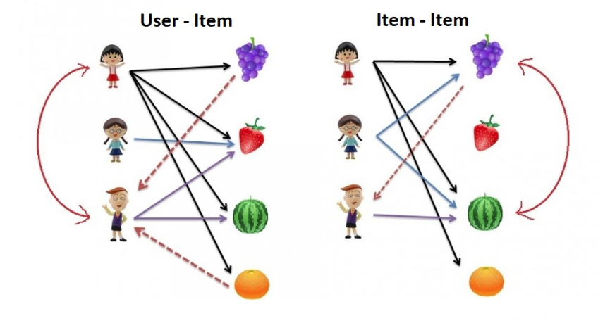
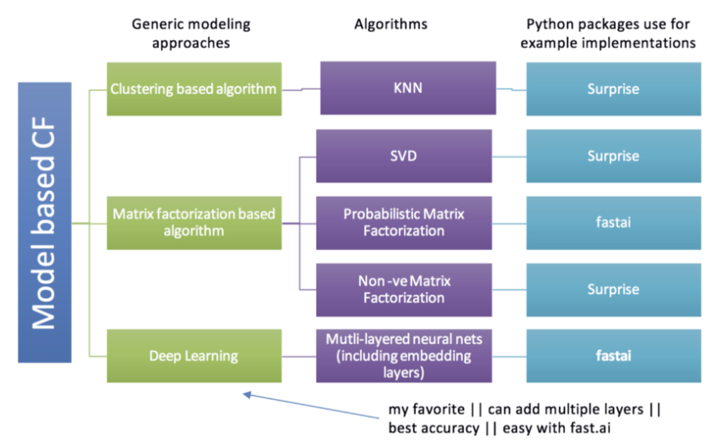

# Spotify Playlist Recommender
## Table of Contents
1. [The task](#the-task)
2. [The dataset](#the-dataset)
3. [Metrics](#metrics)
4. [Proposed Solutions](#proposed-solutions)
5. [Conclusion](#conclusion)

## The task
The aim of this project is to develop a reliable Music Recommendation System using information obtained from the Million Playlist Dataset (MPD). This system aims to take in a set of songs and then use algorithms to recommend songs that are the most similar to the original set, allowing the task of automatic playlist continuation.  The following defines the tasks for this project.

__Input__

A user-created playlist, represented by:
1. Playlist metadata
2. K seed tracks: a list of the K tracks in the playlist, where K can equal 0, 1, 5, 10, 25, or 50.

__Output__

- A list of 100 recommended tracks, ordered by relevance in decreasing order.

## The dataset
The Million Playlist Dataset (MPD) contains 1,000,000 playlists created by users on the Spotify platform. It can be used by researchers interested in exploring how to improve the music listening experience.

The MPD contains a million user-generated playlists. These playlists Ire created during the period of January 2010 through October 2017. Each playlist in the MPD contains a playlist title, the track list (including track metadata) editing information (last edit time, number of playlist edits) and other miscellaneous information about the playlist.

__Detailed description__

The Million Playlist Dataset consists of 1,000 slice files. These files have the naming convention of:

mpd.slice._STARTING\_PLAYLIST\_ID\_-\_ENDING\_PLAYLIST\_ID_.json

For example, the first 1,000 playlists in the MPD are in a file called
`mpd.slice.0-999.json` and the last 1,000 playlists are in a file called
`mpd.slice.999000-999999.json`.

Each slice file is a JSON dictionary with two fields:
*info* and *playlists*.

### `info` Field
The info field is a dictionary that contains general information about the particular slice:

   * **slice** - the range of slices that in in this particular file - such as 0-999
   * ***version*** -  - the current version of the MPD (which should be v1)
   * ***generated_on*** - a timestamp indicating when the slice was generated.

### `playlists` field
This is an array that typically contains 1,000 playlists. Each playlist is a dictionary that contains the following fields:

* ***pid*** - integer - playlist id - the MPD ID of this playlist. This is an integer betIen 0 and 999,999.
* ***name*** - string - the name of the playlist
* ***description*** - optional string - if present, the description given to the playlist.  Note that user-provided playlist descrptions are a relatively new feature of Spotify, so most playlists do not have descriptions.
* ***modified_at*** - seconds - timestamp (in seconds since the epoch) when this playlist was last updated. Times are rounded to midnight GMT of the date when the playlist was last updated.
* ***num_artists*** - the total number of unique artists for the tracks in the playlist.
* ***num_albums*** - the number of unique albums for the tracks in the playlist
* ***num_tracks*** - the number of tracks in the playlist
* ***num_folloIrs*** - the number of folloIrs this playlist had at the time the MPD was created. (Note that the folloIr count does not including the playlist creator)
* ***num_edits*** - the number of separate editing sessions. Tracks added in a two hour window are considered to be added in a single editing session.
* ***duration_ms*** - the total duration of all the tracks in the playlist (in milliseconds)
* ***collaborative*** -  boolean - if true, the playlist is a collaborative playlist. Multiple users may contribute tracks to a collaborative playlist.
* ***tracks*** - an array of information about each track in the playlist. Each element in the array is a dictionary with the following fields:
   * ***track_name*** - the name of the track
   * ***track_uri*** - the Spotify URI of the track
   * ***album_name*** - the name of the track's album
   * ***album_uri*** - the Spotify URI of the album
   * ***artist_name*** - the name of the track's primary artist
   * ***artist_uri*** - the Spotify URI of track's primary artist
   * ***duration_ms*** - the duration of the track in milliseconds
   * ***pos*** - the position of the track in the playlist (zero-based)

Here's an example of a typical playlist entry:

        {
            "name": "musical",
            "collaborative": "false",
            "pid": 5,
            "modified_at": 1493424000,
            "num_albums": 7,
            "num_tracks": 12,
            "num_folloIrs": 1,
            "num_edits": 2,
            "duration_ms": 2657366,
            "num_artists": 6,
            "tracks": [
                {
                    "pos": 0,
                    "artist_name": "Degiheugi",
                    "track_uri": "spotify:track:7vqa3sDmtEaVJ2gcvxtRID",
                    "artist_uri": "spotify:artist:3V2paBXEoZIAhfZRJmo2jL",
                    "track_name": "Finalement",
                    "album_uri": "spotify:album:2KrRMJ9z7Xjoz1Az4O6UML",
                    "duration_ms": 166264,
                    "album_name": "Dancing Chords and Fireflies"
                },
                {
                    "pos": 1,
                    "artist_name": "Degiheugi",
                    "track_uri": "spotify:track:23EOmJivOZ88WJPUbIPjh6",
                    "artist_uri": "spotify:artist:3V2paBXEoZIAhfZRJmo2jL",
                    "track_name": "Betty",
                    "album_uri": "spotify:album:3lUSlvjUoHNA8IkNTqURqd",
                    "duration_ms": 235534,
                    "album_name": "Endless Smile"
                },
                {
                    "pos": 2,
                    "artist_name": "Degiheugi",
                    "track_uri": "spotify:track:1vaffTCJxkyqeJY7zF9a55",
                    "artist_uri": "spotify:artist:3V2paBXEoZIAhfZRJmo2jL",
                    "track_name": "Some Beat in My Head",
                    "album_uri": "spotify:album:2KrRMJ9z7Xjoz1Az4O6UML",
                    "duration_ms": 268050,
                    "album_name": "Dancing Chords and Fireflies"
                },
                // 8 tracks omitted
                {
                    "pos": 11,
                    "artist_name": "Mo' Horizons",
                    "track_uri": "spotify:track:7iwx00eBzeSSSy6xfESyWN",
                    "artist_uri": "spotify:artist:3tuX54dqgS8LsGUvNzgrpP",
                    "track_name": "Fever 99\u00b0",
                    "album_uri": "spotify:album:2Fg1t2tyOSGWkVYHlFfXVf",
                    "duration_ms": 364320,
                    "album_name": "Come Touch The Sun"
                }
            ],

        }

## Challenge Set
I plan to build my own challenge set with some differences based on the official criteria.

__Test Set Format__

The challenge set consists of a single JSON dictionary with three fields:

- __date__ - the date the challenge set was generated.
- __version__ - the version of the challenge set.
- __playlists__ - an array of 10,000 incomplete playlists. Each element in this array contains the following fields:
  - __pid__ - the playlist ID
  - __name__ - (optional) - the name of the playlist. For some playlists in challaneg, the names are missing.
  - __num_holdouts__ - the number of tracks that have been omitted from the playlist
  - __tracks__ - a (possibly empty) array of tracks that are in the playlist. Each element of this array contains the following fields:
    - __pos__ - the position of the track in the playlist (zero offset)
    - __track_name__ - the name of the track
    - __track_uri__ - the Spotify URI of the track
    - __artist_name__ - the name of the primary artist of the track
    - __artist_uri__ - the Spotify URI of the primary artist of the track
    - __album_name__ - the name of the album that the track is on
    - __album_uri__ -- the Spotify URI of the album that the track is on
    - __duration_ms__ - the duration of the track in milliseconds
    - __num_samples__ the number of tracks included in the playlist
    - __num_tracks__ - the total number of tracks in the playlist.

__How to build Test Set__

Dataset contains PID from 0 to 499,999 (0.5 mil playlists), with M unique Tracks

To replicate competition's test set, I will remove some playlists from original playlists such that

- All tracks in the challenge set appear in the MPD
- All holdout tracks appear in the MPD

The test set contains 7 difference challenges, each challenge contains 1000 playlists sampled from MPD:

1. Predict tracks for a playlist given its title and the first 5 tracks
2. Predict tracks for a playlist given its title and the first 10 tracks
3. Predict tracks for a playlist given its title and the first 25 tracks
4. Predict tracks for a playlist given its title and 25 random tracks
5. Predict tracks for a playlist given its title and the first 50 tracks
6. Predict tracks for a playlist given its title and 50 random tracks
7. Predict tracks for a playlist given its title and the first 100 tracks

## Metrics
The following metrics will be used to evaluate the submission. All metrics will be evaluated at both the track level and the artist level. In other words, exact track must match as well as the artist track.

1. R-precision
2. Discounted cumulative gain (DCG)
3. Recommended Songs clicks
4. Rank aggregation

## Proposed Solutions

### Brief overview of recommender:
A recommender system suggests similar products such as books, movies, songs or friends to customers. The two most popular types of recommender are (i) __content-based filtering__ and (ii) __collaborative filtering__.
The content-based systems are effectively less complicated than the collaborative systems. However, they provide much less interesting recommendations.

__Content-based filtering__: Various products/attributes are manually labeled by some experts or customers in this method. The similarity between each product/item can be evaluated once all the features are obtained.

__Collaborative filtering (CF)__: This type does not require manual labelling by the customer/experts. It effectivel looks at the users itself and identify the similar behaviour/attributes. This type of filtering has two types itself; (i) memory-based and (ii) model-based. The model-based CF requires machine learning algorithms such as clustering, matrix factorization and deep learning. The memory-based CF constructs a large matrix of user-item to calculate attributes/behaviours.

The following figure shows the two types of memory based filtering: (i) user to user CF, (ii) item to item CF. Although the memory based algorithm can be easily implemented and produce relatively reasonable predictions, it's drawback is that it can not be scaled to real-world problems.

The following figure shows the generic modelling approaches in model based CF, their corresponding algorithms and python packages. This model uses matrix factorisation and deals much better with scabability and sparsity than the memory based CF. The idea behind the matrix factorisation is that the latent preference and attributes of users can be used to predict the unknown ratings. This is done by the dot product of the latent features of the users and items.

### How Playlist Recommender Would Work:

For this project, I will treat "user" as "playlist" and "item" as "song" and plane to perform the following:
- KNN
- Collaborative Filtering
- Frequent Pattern Growth
- Word2Vec (bonus)

5. Evaluate based on 4 metrics

### Model Based
Matrix factorization can be done using Singular Value Decomposition (SVD). I have extensively used SVD during my PhD to decompose flow structures rank the modes based on their energy content. 

To perform Collaborative Filtering, SVD can be employed to approximate a matrix __X__. The SVD equation is expressed as follows: __X = U × S × V_transpose__

__Deep Learning__ can be employed after the latent feature vectors of playlist  and songs are obtained.  They can be fed to a Deep Learning model or any Machine Learning model to predict the results.

## Conclusion
I am confident that I could build this model should I be given the opportunity to participate in The Data Incubator program. Following my PhD submission in the next few weeks (mid Aug), I plan to dedicate all my time to improve my machine learning knowledge/skills to be able to complete this project before the completion of the Data Incubator program should I be admitted.

## Reference:

1. [Playlist Recommender](https://medium.com/s/story/spotifys-discover-Iekly-how-machine-learning-finds-your-new-music-19a41ab76efe)
2. [Many Types of Recommender Systems](https://blogs.gartner.com/martin-kihn/how-to-build-a-recommender-system-in-python/)
3. [Amazon Recommendations Item-to-Item Collaborative Filtering](http://www.cs.umd.edu/~samir/498/Amazon-Recommendations.pdf)
4. [Millions song dataset](https://www.kaggle.com/c/msdchallenge)
5. [Advantage of item-based CF over user-based CF](https://en.wikipedia.org/wiki/Item-item_collaborative_filtering)
6. [Collaborative Filterring at Spottify](https://www.slideshare.net/erikbern/collaborative-filtering-at-spotify-16182818/62)

